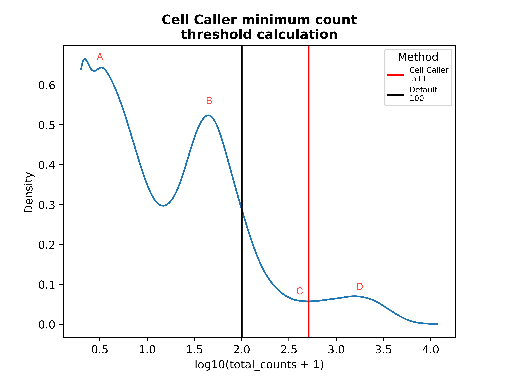
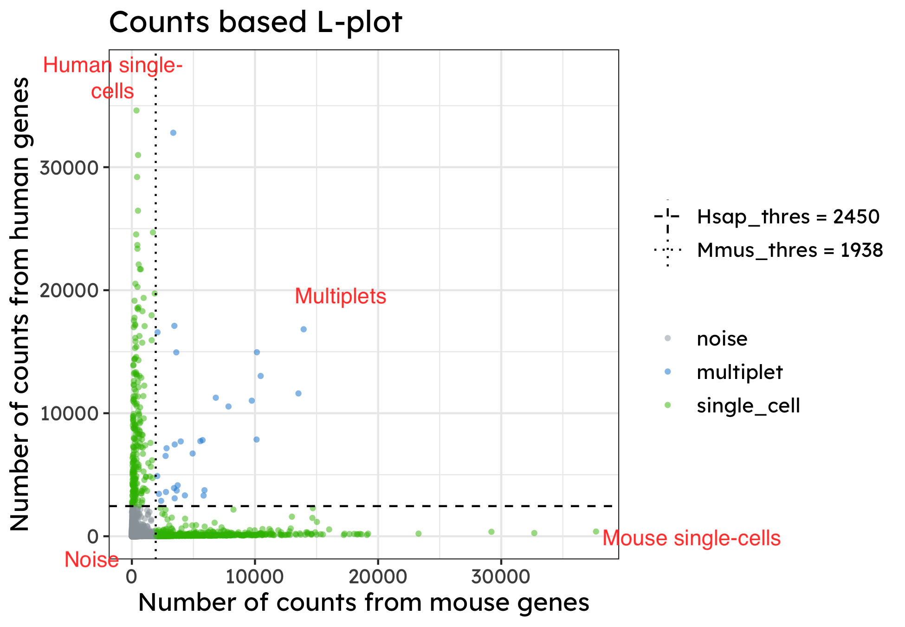
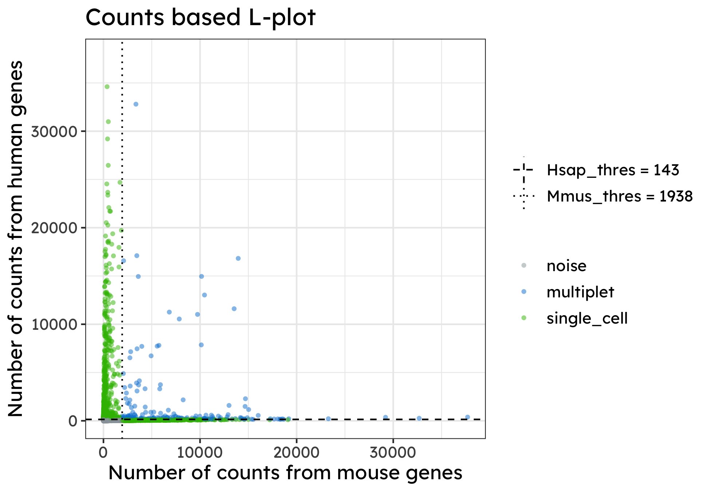
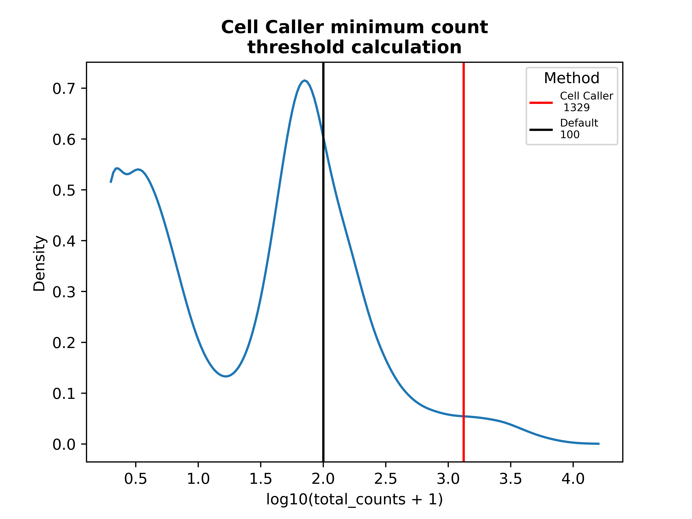
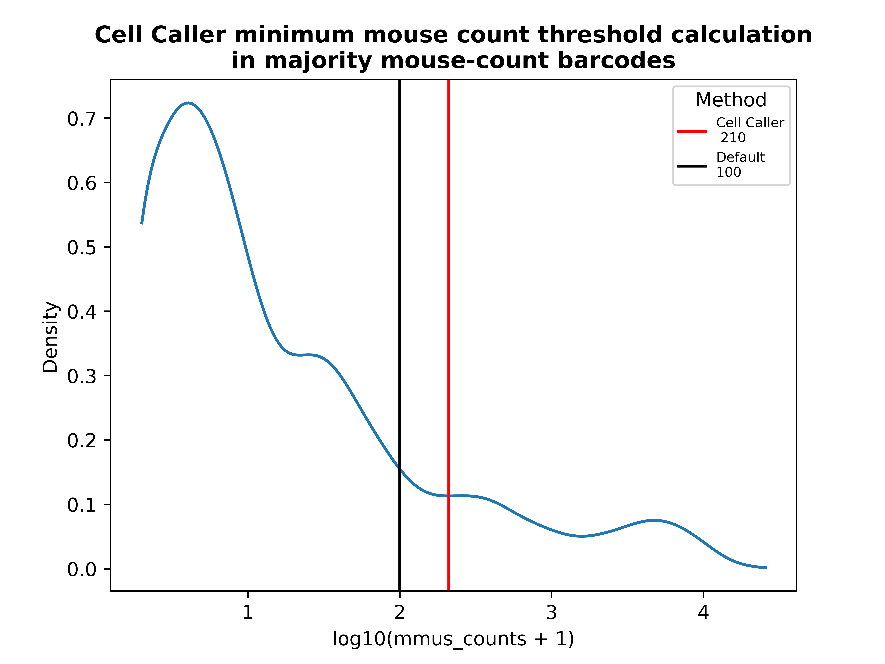

# CS Genetics scRNA-Seq pipeline

**A Nextflow pipeline for processing scRNA-Seq data generated using CS Genetics' single-cell kit to produce qualtity control metrics and a gene expression matrix for single cells.**

[](https://www.nextflow.io/)
[](https://www.docker.com/)
[](https://sylabs.io/docs/)
[](https://docs.conda.io/en/latest/)

## Contents

- [CS Genetics scRNA-Seq pipeline](#cs-genetics-scrna-seq-pipeline)
  - [Contents](#contents)
  - [Introduction](#introduction)
  - [Running the pipeline](#running-the-pipeline)
  - [Pipeline launch examples](#pipeline-launch-examples)
    - [Example 1](#example-1)
    - [Example 2](#example-2)
    - [Example 3](#example-3)
    - [Example 4](#example-4)
  - [Running the pipeline on MacOS](#running-the-pipeline-on-macos)
  - [Specifying input sequencing files](#specifying-input-sequencing-files)
  - [Testing the pipeline](#testing-the-pipeline)
  - [Launching the pipeline directly from the csgenetic/csgenetics\_scrnaseq Github repo](#launching-the-pipeline-directly-from-the-csgeneticcsgenetics_scrnaseq-github-repo)
    - [Updating the pipeline](#updating-the-pipeline)
    - [Specifying a pipeline version](#specifying-a-pipeline-version)
  - [Launching the pipeline from Seqera Platform](#launching-the-pipeline-from-seqera-platform)
  - [Available standard profiles](#available-standard-profiles)
    - [test](#test)
    - [test\_singularity](#test_singularity)
    - [test\_conda](#test_conda)
    - [docker](#docker)
    - [singularity](#singularity)
    - [conda](#conda)
  - [Available curated genomic resources](#available-curated-genomic-resources)
  - [Configuring custom genomic resources](#configuring-custom-genomic-resources)
  - [Configurable parameters](#configurable-parameters)
    - [`profile`](#profile)
    - [`outdir`](#outdir)
    - [`star_index`](#star_index)
      - [Generating a STAR index](#generating-a-star-index)
    - [`gtf`](#gtf)
    - [`mitochondria_chromosome`](#mitochondria_chromosome)
    - [`barcode_list_path`](#barcode_list_path)
    - [`minimum_count_threshold`](#minimum_count_threshold)
  - [Outputs](#outputs)
    - [`count_matrix`](#count_matrix)
    - [`report`](#report)
    - [`pipeline_info`](#pipeline_info)
    - [`fastp`](#fastp)
    - [`featureCounts`](#featurecounts)
    - [`deduplication`](#deduplication)
    - [`multiqc`](#multiqc)
    - [`plots`](#plots)
    - [`RSeQC`](#rseqc)
      - [`read_distribution`](#read_distribution)
    - [`STAR`](#star)
  - [Cell calling](#cell-calling)
    - [Theory of Cell Caller](#theory-of-cell-caller)
      - [Mixed-species cell calling](#mixed-species-cell-calling)
    - [Cell Caller plot examples](#cell-caller-plot-examples)
    - [Setting manual Cell Caller threholds](#setting-manual-cell-caller-thresholds)
  - [Log files](#log-files)
  - [Resource allocation](#resource-allocation)
  - [Error handling](#error-handling)

## Introduction

**CS Genetics' scRNA-Seq pipeline** is a bioinformatics best-practice analysis pipeline for processing single-cell RNA-Seq data from their single-cell RNA-Seq kits.

It runs on a Unix-like operating system (E.g. Linux).

The pipeline is built using [Nextflow](https://www.nextflow.io), a workflow tool to run tasks across multiple compute infrastructures in a portable manner. The pipeline uses Docker, Singularity, or Conda environments to run its constituent processes making installation trivial and results reproducible.

It processes FASTQ files generated by CS Genetics' scRNA-Seq library kit to produce count matrices that can be loaded directly into [Seurat](https://satijalab.org/seurat/index.html) or [scanpy](https://scanpy.readthedocs.io/en/stable/) for further analyses.

<div style="text-align: right"><a href="#cs-genetics-scrna-seq-pipeline">top</a></div>

## Running the pipeline

The pipeline is run natively in your environment but uses Docker/Singularity containers or Conda environments for each of the pipeline's processes.

To run the pipeline locally, you must have Nextflow ([installation instructions](https://www.nextflow.io/docs/latest/getstarted.html#installation)) and git ([installation instructions](https://git-scm.com/book/en/v2/Getting-Started-Installing-Git)) installed. It is recommended that you work with one of the 'docker', 'singularity', or 'conda' profiles
(see [Available standard profiles](#available-standard-profiles) below).

For containerized profiles, you must have the respective program installed: [Docker installation](https://docs.docker.com/get-docker/), [Singularity installation](https://docs.sylabs.io/guides/3.0/user-guide/installation.html).

For the conda profile (recommended for HPC systems that cannot run containers), you must have Conda installed. See [conda profile requirements](#conda-profile-requirements) for details.

With Nextflow, Docker and git installed, clone the csgenetics_scrnaseq repository to a specified directory and change into that directory.

```bash
git clone https://github.com/csgenetics/csgenetics_scrnaseq.git $HOME/analysis && cd $HOME/analysis
```

The pipeline is then run using the Nextflow executable, and in this case, the `docker` profile.

For specification of input sequences see [Specifying input sequencing files](#specifying-input-sequencing-files).

```bash
nextflow run main.nf -profile docker --input_csv $HOME/analysis/input_csv/input_csv.csv --genome GRCh38
```

For a full list of the configurable parameters that can be can be supplied to the pipeline
and other options for configuration see [Configurable parameters](#configurable-parameters).

<div style="text-align: right"><a href="#cs-genetics-scrna-seq-pipeline">top</a></div>

## Pipeline launch examples

Below are some examples of launching the pipeline with explanations of the commands.

### Example 1

```bash
nextflow run main.nf -profile docker --input_csv <path/to/input/csv> --outdir ./results --genome GRCh38
```

A pipeline is launched using a locally installed version of
Nextflow from a locally cloned copy of the csgenetics/csgenetics_scrnaseq repository.

The user is launching against the CG Genetics human reference so they have set `--genome` to `GRCh38`.

The output directory is set to `./results`.

The docker profile is selected, configuring the pipeline to use pre-specified Docker containers for each of the processes.

The `work` directory will by created by default at `./work`.

<div style="text-align: right"><a href="#cs-genetics-scrna-seq-pipeline">top</a></div>

### Example 2

```bash
nextflow run csgenetics/csgenetics_scrnaseq -r 1.1.2 -profile docker --input_csv <path/to/input/csv> --genome GRCh38
```

A pipeline is launched by directly specifying the GitHub repository.
Version 1.1.2 of the pipeline is used.

The `docker` profile is selected, configuring the pipeline to use pre-specified Docker containers for each of the processes.

The remotely hosted Human STAR index and GTF file are used.

The remotely hosted v2 barcode_list is used by default.

<div style="text-align: right"><a href="#cs-genetics-scrna-seq-pipeline">top</a></div>

### Example 3

```bash
nextflow run main.nf -profile docker --input_csv <path/to/input/csv> --outdir ./results --genome custom --star_index </local/path/to/STAR_index/dir> --gtf </local/path/to/gtf> --mitochondria_chromosome 'MT' --barcode_list s3://csgx.public.readonly/resources/barcode_lists/IDT_IO_kit_v2.csv
```

A pipeline is launched using a locally installed version of
Nextflow from a locally cloned copy of the csgenetics/csgenetics_scrnaseq repository.

The user is launching against their own set of references so they have set `--genome` to `custom`,
specified a STAR index directory, a
corresponding GTF, and the name of the mitochondria chromosome used in their reference. The remotely hosted v2 barcode_list is selected explicitly.

The output directory is set to `./results`.

The `docker` profile is selected, configuring the pipeline to use pre-specified Docker containers for each of the processes.

The `work` directory will by created by default at `./work`.

<div style="text-align: right"><a href="#cs-genetics-scrna-seq-pipeline">top</a></div>

### Example 4

```bash
nextflow run main.nf -profile conda --input_csv <path/to/input/csv> --outdir ./results --genome GRCh38
```

A pipeline is launched using the `conda` profile, which uses Conda environments instead of containers for software dependencies. This profile is designed for HPC systems where Docker/Singularity containers cannot be run.

The user is launching against the CS Genetics human reference so they have set `--genome` to `GRCh38`.

The output directory is set to `./results`.

On first run, Conda will create environments for each process, which will be cached for subsequent runs. See [conda profile requirements](#conda-profile-requirements) for setup details.

<div style="text-align: right"><a href="#cs-genetics-scrna-seq-pipeline">top</a></div>

## Running the pipeline on MacOS

While the pipeline can be launched on MacOS, some of the processes are RAM intensive.

In particular, the STAR mapping process is currently configured to run in a container that is allocated 40GB or 60GB of RAM.

The actual resources utilized will depend on the character of the samples being analysed.

However, resource allocations will likely exceed those available on a standard MacOS laptop/desktop.

As such, it is recommened to run the pipeline on an HPC or cloud system.

<div style="text-align: right"><a href="#cs-genetics-scrna-seq-pipeline">top</a></div>

## Specifying input sequencing files

The sequencing files to be analysed are specified using an input csv file.

An example template can be found [here](input_csv/template.csv).

The header row must be present and the full paths to files should be given.

The `fastq_1` should contain the sequencing data that will be mapped to the genome. `fastq_2` should contain the CS Genetics barcode.

Paths may point to cloud-stored files, e.g. an AWS S3 URI, provided Nextflow supports that storage platform.
See the [Nextflow docs](https://www.nextflow.io/docs/latest/aws.html) for further details.

The full path to the input csv should be supplied to the pipeline using the `--input_csv` flag.

E.g.

```bash
nextflow run main.nf -profile docker --input_csv <path/to/csv_dir/input_csv.csv> --genome GRCh38
```

Multiple sets of sequencing files (e.g. from multiple lanes of sequencing)
can be merged by the pipeline and used for a single sample
by supplying the same sample name but with different sequencing file sets
on separate lines.

E.g.

```bash
sample,fastq_1,fastq_2
Sample1,/home/example_user/analysis/raw_reads/example_Sample1_L001_R1_001.fastq.gz,/home/example_user/analysis/raw_reads/example_Sample1_L001_R2_001.fastq.gz
Sample1,/home/example_user/analysis/raw_reads/example_Sample1_L002_R1_001.fastq.gz,/home/example_user/analysis/raw_reads/example_Sample1_L002_R2_001.fastq.gz
Sample2,/home/example_user/analysis/raw_reads/example_Sample2_L001_R1_001.fastq.gz,/home/example_user/analysis/raw_reads/example_Sample2_L001_R2_001.fastq.gz
```

If necessary, manual Cell Caller thresholds can be set in the input csv. See [Cell calling](#cell-calling) and [Setting manual Cell Caller threholds](#setting-manual-Cell Caller-thresholds).

<div style="text-align: right"><a href="#cs-genetics-scrna-seq-pipeline">top</a></div>

## Testing the pipeline

To test that your environment is set up correctly, the pipeline can be run using the `test` profile:

```bash
nextflow run main.nf -profile test
```

The test profile will run using a set of remotely hosted resources and Docker containers. By default, the work and results directories will be created in the current working directory at `./work` and `./results_test`, respectively.

For systems where containers cannot be used, test the pipeline with the `test_conda` profile:

```bash
nextflow run main.nf -profile test_conda
```

This will test the pipeline using Conda environments instead of containers. On first run, Conda will create the required environments, which may take several minutes but will be cached for subsequent runs.

For a full list of the configurable parameters that can be can be supplied to the pipeline
and other options for configuration see [Configurable parameters](#configurable-parameters).

<div style="text-align: right"><a href="#cs-genetics-scrna-seq-pipeline">top</a></div>

## Launching the pipeline directly from the csgenetic/csgenetics_scrnaseq Github repo

In the above examples, the csgenetics_scrnaseq git repostory was cloned locally
and the pipeline was launched specifying the main.nf Nextflow script.

Alternatively, the pipeline can be launched directly from the GitHub repository specifying its qualified name: `csgenetics/csgenetics_scrnaseq`.

See the [Nextflow documentation on Pipeline sharing](https://www.nextflow.io/docs/latest/sharing.html) for further details.

<div style="text-align: right"><a href="#cs-genetics-scrna-seq-pipeline">top</a></div>

### Updating the pipeline

When launching the pipeline from a local clone of the GitHub repository, you will need to keep the pipeline up-to-date by refularly pulling down updates:

```
git pull
```

When launching the pipeline by specifying the qualified name of the pipeline, Nextflow automatically pulls the pipeline code from GitHub and stores it as a cached version. When running the pipeline after this, it will always use the cached version if available - even if the pipeline has been updated since. To make sure that you're running the latest version of the pipeline, make sure that you regularly update the cached version of the pipeline:

```bash
nextflow pull csgenetics/csgenetics_scrnaseq
```

<div style="text-align: right"><a href="#cs-genetics-scrna-seq-pipeline">top</a></div>

### Specifying a pipeline version

It's a good idea to specify a pipeline version (alternatively referred to as a tag or a release) when launching the pipeline. This ensures that a specific version of the pipeline code and software are used when you run your pipeline, thus ensuring reproducibilty.

See the [Nextflow documentation on Pipeline sharing](https://www.nextflow.io/docs/latest/sharing.html) for further details.

The available tags can be displayed in a cloned repository using:
`git tag`

Alternatively, the releases can be viewed [online](https://github.com/csgenetics/csgenetics_scrnaseq/releases).

The pipeline version is passed to the nextflow command using the -r option. See [Example 2](#example-2) for an example.

For reference, the version will be logged in reports when you run the pipeline.

<div style="text-align: right"><a href="#cs-genetics-scrna-seq-pipeline">top</a></div>

## Launching the pipeline from Seqera Platform

The pipeline can be launched from Seqera Platform.

The repository includes a `nextflow_schema.json` file that will automatically display required parameters when launching the pipeline from your Launchpad on Seqera Platform.

To make use of containerization, don't forget to add an appropriate profile e.g. `docker` in the 'Config profiles' section of the 'Add pipeline' dialog.

## Available standard profiles

Nextflow pipeline configurable parameters can be set in groups by specifying profiles.

See the [Config profiles](https://www.nextflow.io/docs/latest/config.html#config-profiles) section of the Netflow documentation for further details.

There are eight standard profiles available for the CS Genetics scRNA-Seq pipeline:

- `test`
  - A profile with a complete configuration for automated testing.
  - Configured to process 2 'lite' samples of 1M raw reads each.
  - Results in approx. 300 and 500 cells at approx. 60 genes detected per cell.
  - Includes links to test data so requires no other parameters.
  - Runs Docker containers for each process using Docker.
  - Takes approx. 5 minutes to run on most systems.
- `test_singularity`
  - A profile with a complete configuration for automated testing.
  - Includes links to test data so requires no other parameters.
  - Runs Docker containers for each process using Singularity.
- `test_conda`
  - A profile with a complete configuration for automated testing.
  - Includes links to test data so requires no other parameters.
  - Uses Conda environments instead of containers for each process.
  - See [conda profile requirements](#conda-profile-requirements) below.
- `docker`
  - A generic configuration profile that enables use of pre-configured Docker containers for each process run using Docker.
- `singularity`
  - A generic configuration profile that enables use of pre-configured Docker containers for each process run using Singularity.
  - See the Nextflow documentation on [Singularity](https://www.nextflow.io/docs/latest/container.html#singularity) for further details.
- `conda`
  - A generic configuration profile that uses Conda environments instead of containers.
  - For users who cannot run Docker/Singularity containers on their HPC systems.
  - See [conda profile requirements](#conda-profile-requirements) below.
- `local`
  - Uses the [local executor](https://www.nextflow.io/docs/latest/executor.html#local). Software required for each process should be pre-installed on your local system.
- `test_pbmc_4_sample_full`
  - Configured to process 4 PBMC samples containing between 54-66M reads resulting in raw reads per cell between 16-24k.
  - Includes links to test data so requires no other parameters.
  - Runs Docker containers for each process using Docker.
  - Will take several hours to run on most systems
- `test_hsap_mmus_2_sample_full`
  - Configured to process 2 H. sapiens / M. musculus mixed species samples containing 99 and 133M reads resulting in raw reads per cell of 50 and 64k.
  - Includes links to test data so requires no other parameters.
  - Runs Docker containers for each process using Docker.
  - Will take several hours to run on most systems

One of the above profiles must be used for the pipeline to be configured correctly.

<div style="text-align: right"><a href="#cs-genetics-scrna-seq-pipeline">top</a></div>

### test

Launching the pipeline with this profile will set configuration parameters so that remotely hosted small, human fastq files and a remotely hosted GRCh38 set of resources are used. The pipeline will use Docker containers for each of the processes.

Note that the pipeline will create the following files in your working directory:

```bash
work            # Directory containing the nextflow working files
results_test    # Finished results
.nextflow_log   # Log file from Nextflow
# Other nextflow hidden files, eg. history of pipeline runs and old logs.
```

E.g.

```bash
nextflow run main.nf -profile test
```

When running the test profile, do not supply the `--input_csv` argument. A remotely hosted input csv is used.

<div style="text-align: right"><a href="#cs-genetics-scrna-seq-pipeline">top</a></div>

### test_singularity

To run the `test` profile using Singularity to launch the Docker containers use the profile `test_singularity`

E.g.

```bash
nextflow run main.nf -profile test_singularity
```

<div style="text-align: right"><a href="#cs-genetics-scrna-seq-pipeline">top</a></div>

### test_conda

To run the `test` profile using Conda environments instead of containers, use the profile `test_conda`. This is useful for HPC systems where Docker/Singularity containers cannot be used.

On first run, Conda will create the required environments which may take several minutes, but these will be cached for subsequent runs.

E.g.

```bash
nextflow run main.nf -profile test_conda
```

See [conda profile requirements](#conda-profile-requirements) for installation requirements.

<div style="text-align: right"><a href="#cs-genetics-scrna-seq-pipeline">top</a></div>

### docker

Launching the pipeline with this profile configures the pipeline to use pre-specified Docker containers for each of the processes. It is recommended to run the pipeline using this profile.

E.g.

```bash
nextflow run main.nf -profile docker --input_csv $HOME/analysis/input_csv/input_csv.csv --genome GRCh38
```

<div style="text-align: right"><a href="#cs-genetics-scrna-seq-pipeline">top</a></div>

### singularity

A generic configuration profile that enables use of pre-configured Docker containers for each process run using Singularity.

E.g.

```bash
nextflow run main.nf -profile singularity --input_csv $HOME/analysis/input_csv/input_csv.csv --genome GRCh38
```

<div style="text-align: right"><a href="#cs-genetics-scrna-seq-pipeline">top</a></div>

### conda

A generic configuration profile that uses Conda environments instead of containers for software dependencies. This profile is designed for users who cannot run Docker or Singularity containers on their HPC systems.

E.g.

```bash
nextflow run main.nf -profile conda --input_csv $HOME/analysis/input_csv/input_csv.csv --genome GRCh38
```

#### Conda profile requirements

**Required software:**
- Conda 25.9.1 or newer must be installed and available in your PATH

**Minimum conda version:**
The pipeline requires conda 25.9.1 or newer.

**Custom conda packages:**
The pipeline uses two custom conda packages hosted on the `cs_genetics` anaconda.org channel:
- `csgenetics-qc` - CS Genetics quality control binary
- `multiqc-csgenetics` - CS Genetics MultiQC plugin

These packages are automatically downloaded from the `cs_genetics` channel during environment creation.

<div style="text-align: right"><a href="#cs-genetics-scrna-seq-pipeline">top</a></div>

## Available curated genomic resources

A set of genomic resources are provided to automatically configure a pipeline run for a specific species or mix of species. To use these resources provide the relevant species key (see below) to the `--genome` command line parameter.

Resources are available for the following species:
- Human; `GRCh38` [build notes](https://s3.amazonaws.com/csgx.public.readonly/resources/references/Ensembl_Gencode_resources/STAR_2_7_11b/GRCh38.Ensembl109.GENCODEv44_with_pcLoF_without_readthrough/build_notes.txt)
- Mouse; `GRCm39` [build notes](https://s3.amazonaws.com/csgx.public.readonly/resources/references/Ensembl_Gencode_resources/STAR_2_7_11b/GRCm39.Ensembl110.GENCODEvM33_with_pcLoF_without_readthrough/build_notes.txt)
- Drosophila melanogaster; `BDGP6` [build notes](https://s3.amazonaws.com/csgx.public.readonly/resources/references/Ensembl_resources/STAR_2_7_11b/Drosophila_melanogaster.BDGP6.46/build_notes.txt)
- Pig; `Sscrofa11` [build notes](https://s3.amazonaws.com/csgx.public.readonly/resources/references/Ensembl_resources/STAR_2_7_11b/Sus_scrofa_Sscrofa11.1/build_notes.txt)
- Danio rerio: `GRCz11` [build notes](https://s3.us-east-1.amazonaws.com/csgx.public.readonly/resources/references/Ensembl_resources/STAR_2_7_11b/Danio_rerio.GRCz11/build_notes.txt)
- Mixed (Human - Mouse); `mouse_human_mix` [build_notes](https://s3.amazonaws.com/csgx.public.readonly/resources/references/Ensembl_Gencode_resources/STAR_2_7_11b/GRCh38.Ensembl109.GENCODEv44_GRCm39.Ensembl110.GENCODEvM33_with_pcLoF_without_readthrough/build_notes.txt)

By passing one of these keys as an argument to `--genome`, the pipeline will automatically be configured to use the relevant set of resources for the following parameters:
- `star_index`
- `gtf`
- `mitochondria_chromosome` (`hsap_mitochondria_chromosome` & `mmus_mitochondria_chromosome` for `mouse_human_mix`)
- `hsap_gene_prefix` & `hsap_gene_prefix` (mixed species only)

E.g.

```bash
nextflow run main.nf -profile singularity --genome GRCh38 --input_csv $HOME/analysis/input_csv/input_csv.csv
```

For supplying custom genomic resources, see the [`star_index`](#star_index), [`gtf`](#gtf), and [`mitochondria_chromosome`](#mitochondria_chromosome) sections below.

<div style="text-align: right"><a href="#cs-genetics-scrna-seq-pipeline">top</a></div>

## Configuring custom genomic resources

To run the pipeline against a user-specified STAR index and corresponding GTF, `--genome` should be set to `custom` and the `--star_index` and `--gtf` arguments should point to the user-provided resources. The `--mitochondria_chromosome` argument should be set to the name of the mitochondrial chromosome in the genome fasta used to build the STAR index (see [Pipeline launch example 3](#example-3), [`star_index`](#star_index), [`gtf`](#gtf), and [`mitochondria_chromosome`](#mitochondria_chromosome) sections below).

<div style="text-align: right"><a href="#cs-genetics-scrna-seq-pipeline">top</a></div>

## Configurable parameters

Please refer to the [Nextflow documentation on configuration](https://www.nextflow.io/docs/latest/config.html)
for a general introduction to configuring Nextflow pipelines.

### `profile`

Use this parameter to choose a configuration profile. See [Available standard profiles](#available-standard-profiles).

```bash
-profile docker
```

N.B. note the single hyphen.

### `outdir`

The output directory where the results will be saved.

```bash
--outdir <path/to/output/dir>
```

### `star_index`

Specify the path (local or cloud-based) of the STAR index directory. Required for mapping.


```bash
--star_index s3://csgx.public.readonly/resources/references/Ensembl_Gencode_resources/STAR_2_7_11b/GRCh38.Ensembl109.GENCODEv44_with_pcLoF_without_readthrough/star/
```

<div style="text-align: right"><a href="#cs-genetics-scrna-seq-pipeline">top</a></div>

#### Generating a STAR index

If you are working with a different species or wish to create your own indexes for a different genome,
please follow the instructions for creating a STAR index [here](https://physiology.med.cornell.edu/faculty/skrabanek/lab/angsd/lecture_notes/STARmanual.pdf) (section 'Generating genome indexes').

Differences in STAR build version and when running STAR for alignments can result in errors.

To avoid this, it is advised that all genomes are generated using our Docker container
that runs STAR version 2.7.11b:

```bash
docker run --rm -it -v $PWD:/mnt -w /mnt quay.io/csgenetics/samtools_star:0.0.2 \
STAR \
--runThreadN NumberOfThreads \
--runMode genomeGenerate \
--genomeDir /path/to/genomeDir \
--genomeFastaFiles /path/to/genome/fasta1 \
--sjdbGTFfile /path/to/annotations.gtf \
--sjdbOverhang ReadLength-1
```

### `gtf`

Path to the gtf (local or cloud-based) annotation file.


```bash
--gtf s3://csgx.public.readonly/resources/references/Ensembl_Gencode_resources/STAR_2_7_11b/GRCh38.Ensembl109.GENCODEv44_with_pcLoF_without_readthrough/genes/gencode.v44.primary_assembly.annotation.modified_seq_names.gene_subset.gtf
```

<div style="text-align: right"><a href="#cs-genetics-scrna-seq-pipeline">top</a></div>

### `mitochondria_chromosome`

The name of the mitochondrial chromosome in the genome fasta used to build the STAR index. DO NOT set this value if using the preconfigured set of genomic resources (see the 'genome' parameter above').


```bash
--mitochondria_chromosome 'MT'
```

<div style="text-align: right"><a href="#cs-genetics-scrna-seq-pipeline">top</a></div>

### `barcode_list_path`

Specify the barcode_list path to use.
The following barcode_lists are hosted remotely at:

- IDT_IO_kit_v2.csv: s3://csgx.public.readonly/resources/barcode_lists/IDT_IO_kit_v2.csv

By default the IDT_IO_kit_v2.csv barcode_list is used.

```bash
--barcode_list_path s3://csgx.public.readonly/resources/barcode_lists/IDT_IO_kit_v2.csv
```

<div style="text-align: right"><a href="#cs-genetics-scrna-seq-pipeline">top</a></div>

### `minimum_count_threshold`

The minimum number of total counts for a given barcode to be considered a cell.

The cell_caller process of the module will generate a count threshold, above which, barcodes will be considered
cells. If the cell_caller determines a theshold < --minimum_count_theshold or if a theshold cannot be determined,
the --minimum_count_theshold will be used.

```bash
--minimum_count_threshold 100
```

<div style="text-align: right"><a href="#cs-genetics-scrna-seq-pipeline">top</a></div>

## Outputs

The output directory is specified using the `--outdir` flag. In this directory, the pipeline outputs a number of useful results organised within the following subdirectories:

<div style="text-align: right"><a href="#cs-genetics-scrna-seq-pipeline">top</a></div>

### `count_matrix`

Contains the count matrices. The matrices are output in two different formats:

- .h5ad (compatible with scanpy in Python)
- the tripartite barcodes.tsv.gz, features.tsv.gz and matrix.mtx.gz (compatible with Seurat in R)

The matrices are output as 'raw' (containing all barcodes) and 'filtered' (containing a subset of the barcodes that were classified as cells through meeting the minimum count threshold).

<div style="text-align: right"><a href="#cs-genetics-scrna-seq-pipeline">top</a></div>

### `report`

Contains the per sample .html reports detailing key statistics for each of the samples.
Metrics are also provided in .csv format.

Contains the experiment report that consolidates metrics for all samples.

### `pipeline_info`

Contains trace files related to the execution of the pipeline.

### `fastp`

Contains the html and json files output from the fastp QC tasks per sample.

<div style="text-align: right"><a href="#cs-genetics-scrna-seq-pipeline">top</a></div>

### `featureCounts`

Contains the files output from the featureCounts process including annotated, filtered bam files.

### `deduplication`

Contains the files associated with deduplication and grouping of reads.

<div style="text-align: right"><a href="#cs-genetics-scrna-seq-pipeline">top</a></div>

### `multiqc`

Contains a multi-sample MultiQC report and associated data, plus a subdirectory single_sample_multiqc containing single-sample reports and associated data. The MultiQC report includes general statistics of fastq files, RSeQC, and fastp outputs.

### `plots`

Plots of the Cell Caller profiles used to generate the minimum detected nuclear genes threshold
for cell calling.

The density plot describes the number of nuclear genes detected (log10 Nuclear genes) across cells. The black line describes the default cutoff value for nuclear genes when calling cells. In contrast, the red line describes the threshold determined by the Cell Caller.

If a red line is not present in the plot then, the default (black line) threshold has been used. If the red line is present, then the Cell Caller threshold has been used.

If no plots are available, this indicates there was not enough counts to produce these plots.

<div style="text-align: right"><a href="#cs-genetics-scrna-seq-pipeline">top</a></div>

### `RSeQC`
#### `read_distribution`
Contains read distribution plots output by RSeQC read_distribution.py. Plots are produced showing the distribution of reads across genomic features for raw reads output from STAR, and annotated reads output from featureCounts.

### `STAR`

Contains the bam files output from STAR and associated mapping log files.

<div style="text-align: right"><a href="#cs-genetics-scrna-seq-pipeline">top</a></div>

## Cell calling

### Theory of Cell Caller
The Cell Caller method distinguishes barcodes associated with cells from those associated with noise. 
It takes the total counts per cellular barcode, log10 + 1 transforms the counts, and evaluates the density distribution of those transformed counts. The transformation is necessary to reduce the spread of the data, in order to identify populations of single-cells and noise.
<br><br>
SimpleCell&trade; libraries typically produce a multimodal distribution, as shown in the example below. The right-most peak in this distribution (D) represents cell-associated barcodes, while the peaks on the left (A, B) contain barcodes with fewer reads, representing noise-associated barcodes.<br><br>

<br><br>The count threshold is determined by finding the first local minima of the probability density (i.e. the lowest point, C) above the minimum_count_threshold (set to 100 counts by default). The count threshold is then used to call cells. Any cellular barcode with counts below the threshold is called as noise, and any barcode with counts above the threshold is called as a cell.
<br><br>If no local minima are found above the `minimum_count_threshold` (set to 100 counts by default), the function looks for a candidate inflection point. This is defined as the first point above the `minimum_count_threshold` where the second derivative is 0 and the gradient is also close to 0 (&lt;0.2). If no inflection point can be found, the threshold defaults to the `minimum_count_threshold`.
In some cases the automatic Cell Caller threshold may be set inappropriately. In these cases it is advised to determine and apply a [manual threshold](#setting-manual-cell-caller-thresholds).

### Mixed-species cell calling
When working with mixed-species samples, Cell Caller first identifies 2 subpopulations of barcodes:  
- Candidate mouse cells, where mouse counts &gt; human counts
- Candidate human cells, where human counts &gt; mouse counts

The Cell Caller algorithm sets a `minimum_count_threshold` for each species by analyzing these subpopulations. For candidate human cells, the total human counts per barcode are transformed according to log10(human_counts + 1), and the local minima of the probability density function is found. The value of human counts at the minima is set as the human threshold.
The same process is applied to candidate mouse cells, using the log-transformed distribution of mouse counts to determine the mouse threshold.
In both cases, if no local minima are found above the `minimum_count_threshold`, the algorithm looks for a suitable inflection point to use instead. If no inflection point is found, the threshold defaults to the `minimum_count_threshold`. 

The combination of the two thresholds is used to classify barcodes according to the following rules:
<br>
1. Human counts &ge; human threshold & mouse counts &le; mouse threshold = human single-cell
2. Mouse counts &ge; mouse threshold & human counts &le; human threshold = mouse single-cell
3. Mouse counts &lt; mouse threshold & human counts &lt; human threshold = noisy barcode
4. Mouse counts &gt; mouse threshold & human counts &gt; human threshold = multiplet



In some instances the mouse or human threshold (or both) may be set inappropriately. In the example below the human threshold has been set too low, resulting in cells that have predominantly mouse counts being wrongly defined as multiplets. In this case we would suggest to [set the human Cell Caller threshold manually.](#setting-manual-cell-caller-thresholds)



### Cell Caller plot examples
A typical Cell Caller plot will have an approximately multimodal distribution with one or more noise-associated peaks on the left and a cell-associated peak on the right.
In this example peak D contains cell-associated barcodes, while peaks A and B contain noise-associated barcodes. The threshold for calling a barcode as a cell is set at the minima between peaks B and D, at 511 counts (2.7 on the log10 scale, C). The default threshold of 100 counts (2 on the log10 scale), is always shown on the plot but only applied if a Cell Caller threshold (the red line on the plot) could not be found by local minima or inflection point. The data is condensed by transformation on a log10 scale, which allows us to better visualise and distinguish the different populations of barcodes. <br><br>


In some cases the noise- and cell-associated peaks may not be well separated, and the cell peak less well defined. In this case it's unlikely that a local minima could be found. In the example below there is no mathematical minima between the noise and cell peaks, so the Cell Caller threshold is set at the first inflection point above 100, which in this case is 1329 counts (3.1 on the log10 scale). Visually we can see that this threshold is set to an appropriate value, as it successfully separates the population of cells on the right from the noise on the left. <br><br>

<br><br>
In rare cases we see novel noise profiles with an additional higher-count noise peak. As these samples have count distributions that are atypical and therefore different to what the current cell calling algorithm expects, the automated threshold can sometimes be set inappropriately. In the example below the Cell Caller threshold has been set inappropriately, lying to the left of the higher-count noise peak. Visually it is clear that the cell-associated peak lies between 3-4 on the log10 scale, with a local minima around 3.1, therefore in this case we would recommend to [set the Cell Caller threshold manually](#setting-manual-cell-caller-thresholds) at approximately 3.1. <br><br>
<a id="triple-peak-plot"></a>

<div style="text-align: right"><a href="#cs-genetics-scrna-seq-pipeline">top</a></div>

## Setting manual Cell Caller thresholds

If the automatic Cell Caller thresholds are inappropriate for your sample, you can apply manual thresholds on a per-sample basis, by modifying the input csv and re-running the pipeline with the [resume](https://www.nextflow.io/docs/latest/cache-and-resume.html) option, e.g. <br>
```bash
nextflow run main.nf -profile <profile> --input_csv <manual_threshold_input.csv> --genome <genome> -resume
```
An appropriate manual threshold can often be determined on visual inspection of the Cell Caller plot, and should be supplied to the input csv in the units log10(counts+1). 
<br><br>
In a single-species experiment, set the *__4th column__* to the desired threshold. If any sample does not require a manual threshold, leaving this column empty will result in Cell Caller determining the threshold for that sample.<br><br>
For example, the threshold for Sample1 and Sample2 will be set as 2.4 and 2.8, respectively. The threshold for Sample3 will be determined by Cell Caller during the pipeline run.

```bash
sample,fastq_1,fastq_2,manual_cell_caller_threshold
Sample1,example_Sample1_L001_R1_001.fastq.gz,example_Sample1_L001_R2_001.fastq.gz,2.4
Sample2,example_Sample2_L001_R1_001.fastq.gz,example_Sample2_L001_R2_001.fastq.gz,2.8
Sample3,example_Sample3_L001_R1_001.fastq.gz,example_Sample3_L001_R2_001.fastq.gz,
```

In a mixed-species experiment, set the *__4th column__* to the desired human (species 1) threshold, and the *__5th column__* to the desired mouse (species 2) threshold. It is required that the columns follow this order, and that both columns are present.
<br><br>If any sample does not require manual thresholds to be set on one or both species, simply leave it blank.
For example, Sample1 will have a manual human threshold of 3.3 and a manual mouse threshold of 3.4. Sample2 will have a manual human threshold of 3.2 and an automatic Cell Caller mouse threshold. Sample3 will have automatic Cell Caller human and mouse thresholds.  

```bash
sample,fastq_1,fastq_2,hsap_manual_cell_caller_threshold,mmus_manual_cell_caller_threshold
Sample1,example_Sample1_L001_R1_001.fastq.gz,example_Sample1_L001_R2_001.fastq.gz,3.3,3.4
Sample2,example_Sample2_L001_R1_001.fastq.gz,example_Sample2_L001_R2_001.fastq.gz,3.2,
Sample3,example_Sample3_L001_R1_001.fastq.gz,example_Sample3_L001_R2_001.fastq.gz,,
```

## Log files
As standard, Nextflow produces a `.nextflow.log` file in the directory from which the pipeline was run.

<div style="text-align: right"><a href="#cs-genetics-scrna-seq-pipeline">top</a></div>

## Resource allocation
### Per process

Process resource allocation uses the `withName` [process selector](https://www.nextflow.io/docs/latest/config.html#process-selectors) in the `conf/base.config` file.

To adjust the resources allocated to a process, modify this file.

Default resource allocations have been made that suit a wide variety of sample types (e.g. number of barcodes, number of reads). However, you may wish to adjust the resources allocated.

### Per pipeline launch
In addition, the total resources not to be exceeded by the pipeline when running with a local executor
can be configured in the `executor` scope in `nextflow.config`.

For example if you are running on a system that has 96GB of RAM and 32 CPUs available,
you may want to modify the `executor` scope values from the defaults of
256 GB of RAM and 16 CPUs.

A modified scope might look like this:
```
# nextflow.config
...
executor {
  cpus = 32
  memory = '96 GB'
}
...
```

<div style="text-align: right"><a href="#cs-genetics-scrna-seq-pipeline">top</a></div>

## Error handling

By default, when a task fails it will be retried (a maximum of 5 times) with increased RAM (`<base RAM>` * task.attempt). Both RAM and num_cpus will not be increased beyond `max_memory` (default `256.GB`) and `max_cpus` (default `16`).

`max_memory` and `max_cpus` can be set on the command line like any other parameter:

```
--max_memory 128.GB --max_cpus 8
```

<div style="text-align: right"><a href="#cs-genetics-scrna-seq-pipeline">top</a></div>

